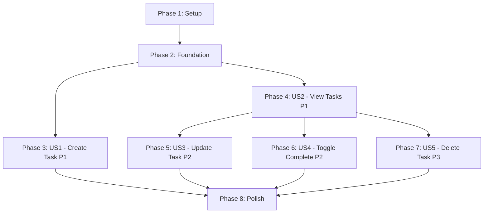

# Tasks: Task Management System

**Feature**: 003-task-crud
**Branch**: `003-task-crud`
**Input**: Design documents from `/specs/003-task-crud/`
**Prerequisites**: plan.md, spec.md, research.md, data-model.md, contracts/task-api.openapi.yaml

**Organization**: Tasks are grouped by user story to enable independent implementation and testing of each story.

**Tests**: No automated tests requested in spec - manual testing via quickstart.md scenarios

## Format: `- [ ] [ID] [P?] [Story?] Description`

- **[P]**: Can run in parallel (different files, no dependencies)
- **[Story]**: Which user story this task belongs to (US1, US2, US3, US4, US5)
- All paths are exact file locations for implementation

## Path Conventions

This feature extends the existing **phase-2-web** monorepo:
- Backend: `phase-2-web/backend/app/`
- Frontend: `phase-2-web/frontend/`
- Database: Neon PostgreSQL (via SQLModel migrations)

---

## Phase 1: Setup (Shared Infrastructure)

**Purpose**: Initialize feature branch and verify prerequisites

**Duration**: 5-10 minutes

- [ ] T001 Verify Better Auth authentication is working (login test at http://localhost:3000/login)
- [ ] T002 Verify Neon PostgreSQL connection from backend (test DATABASE_URL env var)
- [ ] T003 [P] Verify FastAPI backend runs without errors (.venv/bin/python -m uvicorn app.main:app --reload)
- [ ] T004 [P] Verify Next.js frontend runs without errors (npm run dev in phase-2-web/frontend)
- [ ] T005 Create backup of any existing manual code (if found, move to backup-manual-code/)

**Checkpoint**: ✅ All infrastructure services running, authentication works, database connected

---

## Phase 2: Foundational (Blocking Prerequisites)

**Purpose**: Core infrastructure that MUST be complete before ANY user story can be implemented

**⚠️ CRITICAL**: No user story work can begin until this phase is complete

**Duration**: 30-45 minutes

### Database Schema

- [ ] T006 Create Task table migration SQL in phase-2-web/backend/migrations/001_create_tasks_table.sql
- [ ] T007 Run database migration to create tasks table with indexes and triggers
- [ ] T008 Verify tasks table exists in Neon PostgreSQL (psql check or admin panel)

### Backend Foundation

- [ ] T009 [P] Create Task SQLModel in phase-2-web/backend/app/models/task.py
- [ ] T010 [P] Create TaskCreate schema in phase-2-web/backend/app/models/task.py
- [ ] T011 [P] Create TaskUpdate schema in phase-2-web/backend/app/models/task.py
- [ ] T012 [P] Create TaskRead schema in phase-2-web/backend/app/models/task.py
- [ ] T013 Update phase-2-web/backend/app/models/__init__.py to export Task models
- [ ] T014 Create tasks router file in phase-2-web/backend/app/routers/tasks.py with router setup
- [ ] T015 Register tasks router in phase-2-web/backend/app/main.py (app.include_router)

### Frontend Foundation

- [ ] T016 [P] Create Task TypeScript type in phase-2-web/frontend/types/task.ts
- [ ] T017 [P] Create TaskCreate TypeScript type in phase-2-web/frontend/types/task.ts
- [ ] T018 [P] Create TaskUpdate TypeScript type in phase-2-web/frontend/types/task.ts
- [ ] T019 Extend API client in phase-2-web/frontend/lib/api.ts with task method stubs (getTasks, createTask, updateTask, deleteTask, toggleComplete)
- [ ] T020 Create tasks page directory in phase-2-web/frontend/app/(app)/tasks/

**Checkpoint**: ✅ Foundation ready - database table exists, models defined, routers registered, types created. User story implementation can now begin in parallel.

---

## Phase 3: User Story 1 - Create New Task (Priority: P1) 🎯 MVP

**Goal**: Users can create new tasks with title and optional description

**Independent Test**: Authenticate as test user, create task with title "Buy groceries" and description "Milk, eggs, bread", verify task appears in database

**Success Criteria** (from spec):
- SC-001: Users can create a new task in under 10 seconds from clicking "Add Task" to seeing it in their list
- FR-001: System allows authenticated users to create tasks with required title (max 200 chars) and optional description (max 1000 chars)
- FR-007: System validates that task title is not empty before creation

**Dependencies**: Phase 2 complete (foundation ready)

### Implementation for User Story 1

#### Backend (Create Task Endpoint)

- [ ] T021 [P] [US1] Implement POST /api/tasks endpoint in phase-2-web/backend/app/routers/tasks.py
- [ ] T022 [P] [US1] Add get_current_user dependency to POST /api/tasks endpoint for authentication
- [ ] T023 [P] [US1] Implement request validation (title 1-200 chars, description 0-1000 chars)
- [ ] T024 [P] [US1] Implement database insert with user_id from JWT token
- [ ] T025 [P] [US1] Implement response formatting (return created Task with id, timestamps)
- [ ] T026 [P] [US1] Add error handling for validation failures (400) and database errors (500)

#### Frontend (Create Task Form)

- [ ] T027 [P] [US1] Implement createTask API method in phase-2-web/frontend/lib/api.ts
- [ ] T028 [P] [US1] Create TaskForm component in phase-2-web/frontend/components/TaskForm.tsx
- [ ] T029 [US1] Add form state management (title, description, loading, error) in TaskForm
- [ ] T030 [US1] Add form validation (required title, max lengths) in TaskForm
- [ ] T031 [US1] Implement form submission handler calling createTask API in TaskForm
- [ ] T032 [US1] Add error display and success feedback in TaskForm
- [ ] T033 [US1] Add modal/dialog wrapper for TaskForm (QuickAddModal or inline)

**Checkpoint**: ✅ At this point, User Story 1 should be fully functional and testable independently. Users can create tasks via API and frontend form.

**Manual Test** (from quickstart.md):
1. Login as test user
2. Click "Add Task" button
3. Enter title: "Buy groceries"
4. Enter description: "Milk, eggs, bread"
5. Click "Create"
6. Verify task appears in response/database

---

## Phase 4: User Story 2 - View All Tasks (Priority: P1) 🎯 MVP

**Goal**: Users can see a list of all their tasks with titles and completion status

**Independent Test**: Create 3-5 tasks for a test user, call GET /api/tasks, verify all tasks returned with correct user_id filtering

**Success Criteria** (from spec):
- SC-002: Users can view their complete task list within 2 seconds of loading the task page
- SC-003: 100% of users see only their own tasks, never another user's tasks (complete user isolation)
- FR-002: System displays all tasks belonging to the authenticated user in a list format
- FR-006: System enforces user isolation - users can only view their own tasks

**Dependencies**: Phase 2 complete (foundation ready). Can be developed in parallel with US1.

### Implementation for User Story 2

#### Backend (List Tasks Endpoint)

- [ ] T034 [P] [US2] Implement GET /api/tasks endpoint in phase-2-web/backend/app/routers/tasks.py
- [ ] T035 [P] [US2] Add get_current_user dependency to GET /api/tasks endpoint
- [ ] T036 [P] [US2] Implement database query filtering by user_id (WHERE user_id == current_user.id)
- [ ] T037 [P] [US2] Implement ordering by created_at DESC (most recent first)
- [ ] T038 [P] [US2] Add error handling for database errors (500) and authentication (401)

#### Backend (Get Single Task Endpoint)

- [ ] T039 [P] [US2] Implement GET /api/tasks/{id} endpoint in phase-2-web/backend/app/routers/tasks.py
- [ ] T040 [P] [US2] Add get_current_user dependency and user_id filter (security)
- [ ] T041 [P] [US2] Return 404 if task not found or belongs to different user
- [ ] T042 [P] [US2] Add error handling for invalid ID format

#### Frontend (Task List Display)

- [ ] T043 [P] [US2] Implement getTasks API method in phase-2-web/frontend/lib/api.ts
- [ ] T044 [P] [US2] Create TaskItem component in phase-2-web/frontend/components/TaskItem.tsx
- [ ] T045 [P] [US2] Create TaskList component in phase-2-web/frontend/components/TaskList.tsx
- [ ] T046 [US2] Add state management (tasks, loading, error) in TaskList component
- [ ] T047 [US2] Implement useEffect to fetch tasks on mount in TaskList
- [ ] T048 [US2] Implement task list rendering (map over tasks array) in TaskList
- [ ] T049 [US2] Add empty state message "No tasks yet. Create your first task!" in TaskList
- [ ] T050 [US2] Add loading state display in TaskList
- [ ] T051 [US2] Add error state display in TaskList
- [ ] T052 [US2] Implement visual distinction for completed vs incomplete tasks in TaskItem
- [ ] T053 [US2] Create tasks page in phase-2-web/frontend/app/(app)/tasks/page.tsx
- [ ] T054 [US2] Integrate TaskList component in tasks page
- [ ] T055 [US2] Add page layout and styling (headers, containers) in tasks page

**Checkpoint**: ✅ At this point, User Stories 1 AND 2 should both work independently. Users can create tasks (US1) and view all their tasks (US2). Complete user isolation is enforced.

**Manual Test** (from quickstart.md - Scenario 2):
1. Login as userA@example.com
2. Create 3 tasks
3. Logout, login as userB@example.com
4. Create 5 tasks
5. Logout, login as userA again
6. Verify ONLY 3 tasks visible (not userB's 5 tasks)
7. Verify user isolation working correctly

---

## Phase 5: User Story 3 - Update Existing Task (Priority: P2)

**Goal**: Users can edit task title and description to correct mistakes or add information

**Independent Test**: Create task "Buy milk", update to "Buy milk and eggs" with description "From Whole Foods", verify changes persisted

**Success Criteria** (from spec):
- SC-006: Users can update task details and see changes persist after page refresh (100% data persistence)
- FR-003: System allows users to update the title and description of their own tasks
- FR-006: System enforces user isolation - users can only update their own tasks

**Dependencies**: US2 complete (need to display tasks before editing them)

### Implementation for User Story 3

#### Backend (Update Task Endpoint)

- [ ] T056 [P] [US3] Implement PUT /api/tasks/{id} endpoint in phase-2-web/backend/app/routers/tasks.py
- [ ] T057 [P] [US3] Add get_current_user dependency and user_id filter (security check)
- [ ] T058 [P] [US3] Implement database query to fetch existing task (verify ownership)
- [ ] T059 [US3] Return 404 if task not found or belongs to different user
- [ ] T060 [US3] Implement field update logic (title, description) with validation
- [ ] T061 [US3] Auto-update updated_at timestamp
- [ ] T062 [US3] Validate title (1-200 chars) and description (0-1000 chars)
- [ ] T063 [US3] Save changes to database with error handling
- [ ] T064 [US3] Return updated task in response

#### Frontend (Edit Task UI)

- [ ] T065 [P] [US3] Implement updateTask API method in phase-2-web/frontend/lib/api.ts
- [ ] T066 [P] [US3] Add edit mode state to TaskForm component (create vs edit)
- [ ] T067 [US3] Implement form pre-population with existing task data in TaskForm
- [ ] T068 [US3] Update form submission handler to call updateTask API when editing
- [ ] T069 [US3] Add "Edit" button to TaskItem component
- [ ] T070 [US3] Implement edit button click handler to open TaskForm in edit mode
- [ ] T071 [US3] Update TaskList to refresh after successful update
- [ ] T072 [US3] Add optimistic UI update (show changes immediately before API response)
- [ ] T073 [US3] Add rollback on error (revert optimistic update if API fails)

**Checkpoint**: ✅ At this point, User Stories 1, 2, AND 3 should all work independently. Users can create, view, and update tasks. Changes persist after page refresh.

**Manual Test** (from quickstart.md - Scenario 1 step 5):
1. Create task "Buy groceries"
2. Click "Edit" button
3. Change title to "Buy groceries - Done"
4. Save changes
5. Refresh page
6. Verify title still shows "Buy groceries - Done"

---

## Phase 6: User Story 4 - Mark Task Complete (Priority: P2)

**Goal**: Users can toggle task completion status to track progress

**Independent Test**: Create task "Test feature", mark complete (completed=true), verify visual indicator, mark incomplete (completed=false), verify status toggles

**Success Criteria** (from spec):
- SC-004: Users can toggle task completion status with a single click and see visual feedback within 1 second
- FR-004: System allows users to toggle the completion status of their own tasks (complete/incomplete)
- FR-006: System enforces user isolation - users can only toggle their own tasks

**Dependencies**: US2 complete (need to display tasks with completion status)

### Implementation for User Story 4

#### Backend (Toggle Complete Endpoint)

- [ ] T074 [P] [US4] Implement PATCH /api/tasks/{id}/complete endpoint in phase-2-web/backend/app/routers/tasks.py
- [ ] T075 [P] [US4] Add get_current_user dependency and user_id filter (security check)
- [ ] T076 [P] [US4] Implement database query to fetch existing task (verify ownership)
- [ ] T077 [US4] Return 404 if task not found or belongs to different user
- [ ] T078 [US4] Implement toggle logic (completed = !completed)
- [ ] T079 [US4] Auto-update updated_at timestamp
- [ ] T080 [US4] Save changes to database with error handling
- [ ] T081 [US4] Return updated task in response

#### Frontend (Toggle Complete UI)

- [ ] T082 [P] [US4] Implement toggleComplete API method in phase-2-web/frontend/lib/api.ts
- [ ] T083 [P] [US4] Add checkbox or toggle button to TaskItem component
- [ ] T084 [US4] Implement toggle click handler calling toggleComplete API
- [ ] T085 [US4] Add visual feedback (strikethrough, checkmark, color change) for completed tasks
- [ ] T086 [US4] Update TaskList to reflect completion status immediately (optimistic update)
- [ ] T087 [US4] Add loading state during toggle operation
- [ ] T088 [US4] Add error handling and rollback on failure

**Checkpoint**: ✅ At this point, User Stories 1-4 should all work independently. Users can create, view, update, and toggle completion status. All operations respond within 1 second (SC-004).

**Manual Test** (from quickstart.md - Scenario 1 step 4):
1. Create task "Complete project report"
2. Click checkbox/toggle button
3. Verify task shows as completed (visual indicator appears)
4. Click again
5. Verify task shows as incomplete
6. Refresh page
7. Verify completion status persists

---

## Phase 7: User Story 5 - Delete Task (Priority: P3)

**Goal**: Users can permanently delete tasks with confirmation to keep task list clean

**Independent Test**: Create task "Delete me", click delete, confirm deletion, verify task no longer appears in list or database

**Success Criteria** (from spec):
- SC-007: Task deletion requires explicit confirmation - 0 accidental deletions without user approval
- FR-005: System allows users to permanently delete their own tasks after confirmation
- FR-006: System enforces user isolation - users can only delete their own tasks

**Dependencies**: US2 complete (need to display tasks before deleting them)

### Implementation for User Story 5

#### Backend (Delete Task Endpoint)

- [ ] T089 [P] [US5] Implement DELETE /api/tasks/{id} endpoint in phase-2-web/backend/app/routers/tasks.py
- [ ] T090 [P] [US5] Add get_current_user dependency and user_id filter (security check)
- [ ] T091 [P] [US5] Implement database query to verify task exists and belongs to user
- [ ] T092 [US5] Return 404 if task not found or belongs to different user
- [ ] T093 [US5] Implement database delete operation
- [ ] T094 [US5] Return 204 No Content on successful deletion
- [ ] T095 [US5] Add error handling for database errors

#### Frontend (Delete Task UI)

- [ ] T096 [P] [US5] Implement deleteTask API method in phase-2-web/frontend/lib/api.ts
- [ ] T097 [P] [US5] Add "Delete" button to TaskItem component
- [ ] T098 [US5] Implement confirmation dialog/modal (browser confirm() or custom modal)
- [ ] T099 [US5] Implement delete button click handler to show confirmation
- [ ] T100 [US5] Implement confirmed deletion calling deleteTask API
- [ ] T101 [US5] Update TaskList to remove deleted task from state immediately (optimistic update)
- [ ] T102 [US5] Add loading state during delete operation
- [ ] T103 [US5] Add error handling and rollback on failure (restore task to list)
- [ ] T104 [US5] Handle cancel action (close dialog without deleting)

**Checkpoint**: ✅ All 5 user stories should now be independently functional. Complete task management CRUD is available.

**Manual Test** (from quickstart.md - Scenario 1 step 6):
1. Create task "Outdated reminder"
2. Click "Delete" button
3. Verify confirmation prompt appears
4. Click "Cancel"
5. Verify task still in list
6. Click "Delete" again
7. Click "Confirm"
8. Verify task disappears immediately
9. Refresh page
10. Verify task still deleted (not in list)

---

## Phase 8: Polish & Cross-Cutting Concerns

**Purpose**: UI/UX improvements, error handling, and documentation

**Duration**: 30-60 minutes

### Error Handling & Validation

- [ ] T105 [P] Add comprehensive error messages for all validation failures (frontend)
- [ ] T106 [P] Implement toast notifications or alert system for operation feedback
- [ ] T107 [P] Add loading states for all async operations
- [ ] T108 [P] Implement retry logic for failed API calls

### UI/UX Polish

- [ ] T109 [P] Add responsive design for mobile devices (TaskList, TaskItem, TaskForm)
- [ ] T110 [P] Implement keyboard shortcuts (Enter to submit, Escape to cancel)
- [ ] T111 [P] Add animations for task creation, completion toggle, and deletion
- [ ] T112 [P] Improve empty state design with helpful messaging and call-to-action
- [ ] T113 [P] Add task count display ("5 tasks, 2 completed")
- [ ] T114 [P] Implement proper focus management (focus first field on form open)

### Performance Optimization

- [ ] T115 [P] Add database indexes validation (verify idx_tasks_user_id exists)
- [ ] T116 [P] Implement frontend memoization for expensive renders (React.memo)
- [ ] T117 [P] Add pagination if user has >50 tasks (optional for MVP)

### Documentation & Testing

- [ ] T118 [P] Update CLAUDE.md with task management patterns and file locations
- [ ] T119 [P] Create API documentation page (link to contracts/task-api.openapi.yaml)
- [ ] T120 [P] Add JSDoc comments to all frontend components
- [ ] T121 [P] Add docstrings to all backend endpoints and functions
- [ ] T122 Run manual test Scenario 1 (Complete Task Lifecycle) from quickstart.md
- [ ] T123 Run manual test Scenario 2 (Multi-User Isolation) from quickstart.md
- [ ] T124 Run manual test Scenario 3 (Input Validation) from quickstart.md
- [ ] T125 Run manual test Scenario 4 (Edge Case Handling) from quickstart.md
- [ ] T126 Document any bugs found and create fix tasks

**Final Checkpoint**: ✅ All user stories working, manual tests passed, documentation complete, ready for deployment

---

## Dependencies

### Story Completion Order

**Critical Path**:
1. Phase 1 (Setup) → Phase 2 (Foundation) → Phase 4 (US2 - View Tasks)
2. Phase 2 → Phase 3 (US1 - Create Task) can run in parallel with US2
3. US2 must complete before US3, US4, US5 (need to view tasks before editing/deleting)
4. US3, US4, US5 can run in parallel (independent features)
5. Phase 8 (Polish) waits for all user stories

### Parallel Execution Opportunities

**After Phase 2 completes**:
- US1 (Create) and US2 (View) can be developed simultaneously by different developers
- Backend tasks within each story can run in parallel (marked with [P])
- Frontend tasks within each story can run in parallel (marked with [P])

**After US2 completes**:
- US3 (Update), US4 (Toggle), and US5 (Delete) can all be developed in parallel
- Each is an independent feature with no shared code

**Parallel Tasks Example** (Phase 3 - US1):
- T021, T022, T023, T024, T025, T026 (backend) can run simultaneously
- T027, T028 (frontend) can run while backend is being developed
- Total time for US1: ~30 minutes instead of 3+ hours if done sequentially

---

## Implementation Strategy

### MVP-First Approach (Recommended)

**MVP = User Story 1 + User Story 2** (Create + View tasks)

1. Complete Phase 1 (Setup) + Phase 2 (Foundation): ~45 minutes
2. Complete Phase 3 (US1 - Create): ~30 minutes
3. Complete Phase 4 (US2 - View): ~30 minutes
4. **STOP AND TEST**: Run manual tests, verify user isolation works
5. Deploy MVP to staging
6. Get user feedback

**Then continue with P2 stories**:
7. Complete Phase 5 (US3 - Update): ~30 minutes
8. Complete Phase 6 (US4 - Toggle): ~30 minutes
9. Test and deploy

**Finally add P3 story**:
10. Complete Phase 7 (US5 - Delete): ~30 minutes
11. Complete Phase 8 (Polish): ~60 minutes
12. Final testing and production deployment

**Total Estimated Time**: 4-5 hours for complete implementation

### Alternative: All-at-Once Approach

Complete all phases sequentially:
1. Phase 1 → Phase 2 → Phase 3 → Phase 4 → Phase 5 → Phase 6 → Phase 7 → Phase 8
2. Test everything together at the end
3. Single deployment

**Risk**: Higher risk of integration issues, harder to debug

**Recommendation**: Use MVP-First approach for better risk management and faster user value delivery

---

## Task Summary

**Total Tasks**: 126
- Phase 1 (Setup): 5 tasks
- Phase 2 (Foundation): 15 tasks
- Phase 3 (US1 - Create): 13 tasks
- Phase 4 (US2 - View): 22 tasks
- Phase 5 (US3 - Update): 18 tasks
- Phase 6 (US4 - Toggle): 15 tasks
- Phase 7 (US5 - Delete): 16 tasks
- Phase 8 (Polish): 22 tasks

**Parallelizable Tasks**: 87 tasks marked with [P] (69% can run in parallel)

**Critical Path Length**: ~20 sequential tasks (remaining 31%)

**User Story Breakdown**:
- US1 (P1 - Create): 13 tasks
- US2 (P1 - View): 22 tasks
- US3 (P2 - Update): 18 tasks
- US4 (P2 - Toggle): 15 tasks
- US5 (P3 - Delete): 16 tasks

**MVP Scope** (US1 + US2 only):
- Setup: 5 tasks
- Foundation: 15 tasks
- US1: 13 tasks
- US2: 22 tasks
- **Total for MVP**: 55 tasks (~44% of total)

---

## Next Steps

1. Review this task breakdown with team/stakeholders
2. Decide on implementation strategy (MVP-First recommended)
3. Assign tasks to developers (can parallelize after Phase 2)
4. Execute tasks using `/sp.implement` or manual coding
5. Run manual tests from quickstart.md after each user story
6. Document any deviations or bugs discovered
7. Deploy incrementally (MVP first, then P2 stories, then P3)

**Ready to begin implementation**: All tasks are actionable with exact file paths and clear acceptance criteria.
